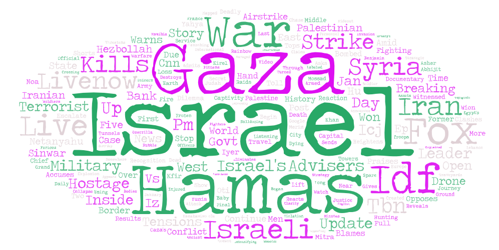

# Webscrape project

## 1) Topic and Search Parameters

The topic that I chose for this lab is understanding the public discourse behind the Israel-Hamas conflict narrative on YouTube. The search parameters for this project are 'Israel' and 'Gaza'.

## 2) Reasons for comparison

The reasons for comparison is to understand the different narratives and perspectives of news outlets surrounding the current Israel-Hamas war. Through analyzing this comparison, we have the ability to view public perception and other insights into biases and other narratives through online platforms.

## 3) Comparison of Word Clouds

When comparing both of the word clouds that were generated, it appeared that there were key similarities as well as defining differences. The similarities were that a lot of the key terms were 'death', 'war', and 'conflict/crisis', illustrating overalapping sentiments of both sides.

However, a few terms that were distinct to the Israel wordcloud were lot of Iranian-backed proxy militants and other surrounding Arab countries around it. Some examples include 'Hezbollah', 'Hamas', 'Syria', 'Iran'. In addition to this, there were lots of verb-based terms, such as 'airstrike', 'kills', 'opposes', and 'warns'.

With Gaza, some of the key terms were more generalized, with some being 'deaths', 'bombs', 'toll', and 'crisis'. Overall, these terms reflect a more 'conflict' related theme.

## 4) Possible reasons for patterns

A few possible reasons for these patterns in the wordcloud are media biases in the current geopolitical climate, as well as audience demographics. The current URL crawler may only cover a range of news outlets that had the most views, leading to the prominence of certain keywords. The current geopolitical context, the war between Israel and Hamas, including Middle Eastern proxy states also may have influenced the keywords.

## 5) Future Research Improvements

One method of future research improvements would be to continuously create a timeline of events of the current conflict in the Middle-east, and then utilizing the webscrape tool, create updated wordclouds to measure the changes in the previous wordclouds. This would not only give more perspective on the biases on the issue, but give better perceptions on the holistic sentiment of the conflict.

## 6) Unexpected findings or insights

An unexpected finding out of this specific assignment would be that most of the Arab countries that either directly or indirectly support Gaza (financial or military aid) such as "Hezbollah," "Hamas," "Syria," and "Iran," were found in the 'Israel' wordcloud, rather than in the 'Gaza' wordcloud. This overall highlights how contentious issues such as the ongoing conflict in Israel and the Gaza strip represent a more broader geopolitical conflict landscape.

## 7) Exported word clouds/data spreadsheets

### Gaza 

### Israel

